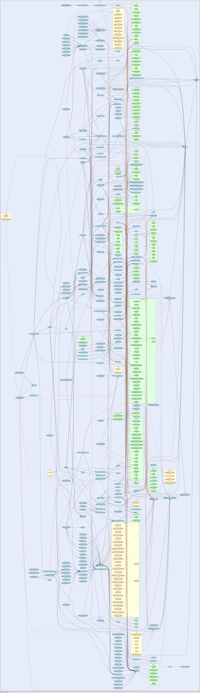

## 利用工具查看调用栈
可以使用`go-callvis`进行解析
```shell
go install github.com/ofabry/go-callvis
```

查看调用栈
```shell
go-callvis main.go
```


## 关键代码解析

```go
// 获取一个gin框架实例
gin.Default()

// 具体的Default方法
func Default() *Engine {
	// 调试模式日志输出 
	// 🌟很不错的设计
	debugPrintWARNINGDefault()
	// 创建一个gin框架实例
	engine := New()
	// 是不是很眼熟 和iris里注册中间件的方式一致
	// 不过比iris好的是支持多参数 iris则是得调用多次
	engine.Use(Logger(), Recovery())
	return engine
}

// 创建一个gin框架实例 具体方法
func New() *Engine {
	// 调试模式日志输出 
	debugPrintWARNINGNew()
	// 先插入一个小话题，可能好多人都在想为什么叫gin呢？
	// 哈哈，这个框架实例的结构体实际命名的Engine, 很明显gin就是一个很个性的简称了，是不是真相大白了。
	// 初始化一个Engine实例
	engine := &Engine{
		// 路由组
		// 给框架实例绑定上一个路由组
		RouterGroup: RouterGroup{
			// engine.Use 注册的中间方法到这里
			Handlers: nil,
			basePath: "/",
			// 是否是路由根节点
			root:     true,
		},
		FuncMap:                template.FuncMap{},
		RedirectTrailingSlash:  true,
		RedirectFixedPath:      false,
		HandleMethodNotAllowed: false,
		ForwardedByClientIP:    true,
		AppEngine:              defaultAppEngine,
		UseRawPath:             false,
		UnescapePathValues:     true,
		MaxMultipartMemory:     defaultMultipartMemory,
		// 路由树
		// 我们的路由最终注册到了这里
		trees:                  make(methodTrees, 0, 9),
		delims:                 render.Delims{Left: "{{", Right: "}}"},
		secureJsonPrefix:       "while(1);",
	}
	// RouterGroup绑定engine自身的实例
	// 不太明白为何如此设计
	// 职责分明么？
	engine.RouterGroup.engine = engine
	// 绑定从实例池获取上下文的闭包方法
	engine.pool.New = func() interface{} {
		// 获取一个Context实例
		return engine.allocateContext()
	}
	// 返回框架实例
	return engine
}

// 注册日志&goroutin panic捕获中间件
engine.Use(Logger(), Recovery())

// 具体的注册中间件的方法
func (engine *Engine) Use(middleware ...HandlerFunc) IRoutes {
	engine.RouterGroup.Use(middleware...)
	engine.rebuild404Handlers()
	engine.rebuild405Handlers()
	return engine
}

// 上面 是一个engine框架实例初始化的关键代码
// 我们基本看完了
// --------------router--------------
// 接下来 开始看路由注册部分

// 注册GET请求路由
func (group *RouterGroup) GET(relativePath string, handlers ...HandlerFunc) IRoutes {
	// 往路由组内 注册GET请求路由
	return group.handle("GET", relativePath, handlers)
}

func (group *RouterGroup) handle(httpMethod, relativePath string, handlers HandlersChain) IRoutes {
	absolutePath := group.calculateAbsolutePath(relativePath)
	// 把中间件的handle和该路由的handle合并
	handlers = group.combineHandlers(handlers)
	// 注册一个GET集合的路由
	group.engine.addRoute(httpMethod, absolutePath, handlers)
	return group.returnObj()
}

func (engine *Engine) addRoute(method, path string, handlers HandlersChain) {
	assert1(path[0] == '/', "path must begin with '/'")
	assert1(method != "", "HTTP method can not be empty")
	assert1(len(handlers) > 0, "there must be at least one handler")

	debugPrintRoute(method, path, handlers)
	// 检查有没有对应method集合的路由
	root := engine.trees.get(method)
	if root == nil {
		// 没有 创建一个新的路由节点
		root = new(node)
		// 添加该method的路由tree到当前的路由到路由树里
		engine.trees = append(engine.trees, methodTree{method: method, root: root})
	}
	// 添加路由
	root.addRoute(path, handlers)
}

// 很关键
// 路由树节点
type node struct {
	// 路由path
	path      string
	indices   string
	// 子路由节点
	children  []*node
	// 所有的handle 构成一个链
	handlers  HandlersChain
	priority  uint32
	nType     nodeType
	maxParams uint8
	wildChild bool
}

// 上面 
// 我们基本看完了
// --------------http server--------------
// 接下来 开始看gin如何启动的http server

func (engine *Engine) Run(addr ...string) (err error) {
	defer func() { debugPrintError(err) }()

	address := resolveAddress(addr)
	debugPrint("Listening and serving HTTP on %s\n", address)
	// 执行http包的ListenAndServe方法 启动路由
	// engine实现了http.Handler接口 所以在这里作为参数传参进去
	// 后面我们再看engine.ServeHTTP的具体逻辑
	err = http.ListenAndServe(address, engine)
	return
}

// engine自身就实现了Handler接口
type Handler interface {
	ServeHTTP(ResponseWriter, *Request)
}

// 下面就是网络相关了
// 监听IP+端口
ln, err := net.Listen("tcp", addr)

// 上面执行完了监听
// 接着就是Serve
srv.Serve(tcpKeepAliveListener{ln.(*net.TCPListener)})

// Accept请求
rw, e := l.Accept()

// 使用goroutine去处理一个请求
// 最终就执行的是engine的ServeHTTP方法
go c.serve(ctx)

// 上面服务已经启动起来了
// --------------handle request--------------
// 接着我们来看看engine的ServeHTTP方法的具体内容
// engine实现http.Handler接口ServeHTTP的具体方法
func (engine *Engine) ServeHTTP(w http.ResponseWriter, req *http.Request) {
	// 获取一个上下文实例
	// 从实例池获取 性能高
	c := engine.pool.Get().(*Context)
	// 重置获取到的上下文实例的http.ResponseWriter
	c.writermem.reset(w)
	// 重置获取到的上下文实例*http.Request
	c.Request = req
	// 重置获取到的上下文实例的其他属性
	c.reset()

	// 实际处理请求的地方
	// 传递当前的上下文
	engine.handleHTTPRequest(c)

	//归还上下文实例
	engine.pool.Put(c)
}

// 具体执行路由的方法
engine.handleHTTPRequest(c)

t := engine.trees
for i, tl := 0, len(t); i < tl; i++ {
	// 这里寻找当前请求method的路由树节点
	// 我在想这里为啥不用map呢？
	// 虽说也遍历不了几次
	if t[i].method != httpMethod {
		continue
	}
	// 找到节点
	root := t[i].root
	// 很关键的地方
	// 寻找当前请求的路由
	handlers, params, tsr := root.getValue(path, c.Params, unescape)
	if handlers != nil {
		// 把找到的handles赋值给上下文
		c.handlers = handlers
		// 把找到的入参赋值给上下文
		c.Params = params
		// 执行handle
		c.Next()
		// 处理响应内容
		c.writermem.WriteHeaderNow()
		return
	}
	...
}

// 方法树结构体
type methodTree struct {
	// HTTP Method
	method string
	// 当前HTTP Method的路由节点
	root   *node
}

// 方法树集合
type methodTrees []methodTree

// 执行handle
func (c *Context) Next() {
	// 上下文处理之后c.index被执为-1
	c.index++
	for s := int8(len(c.handlers)); c.index < s; c.index++ {
		// 遍历执行所有handle(其实就是中间件+路由handle)
		// 首先感觉这里的设计又是似曾相识 iris不是也是这样么 不懂了 哈哈
		// 其次感觉这里设计的很一般 遍历？多无聊，这里多么适合「责任链模式」
		// 之后给大家带来关于这个handle执行的「责任链模式」的设计
		c.handlers[c.index](c)
	}
}

// Context的重置方法
func (c *Context) reset() {
	c.Writer = &c.writermem
	c.Params = c.Params[0:0]
	c.handlers = nil
	// 很关键 注意这里是-1哦
	c.index = -1
	c.Keys = nil
	c.Errors = c.Errors[0:0]
	c.Accepted = nil
}
```